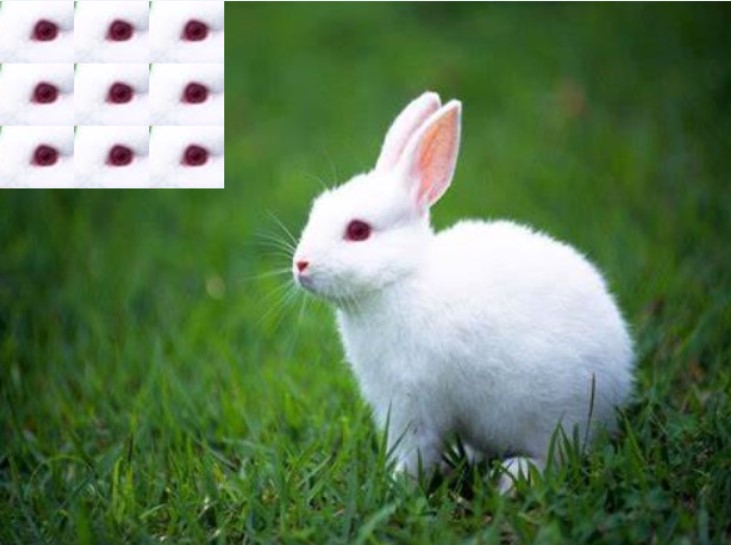
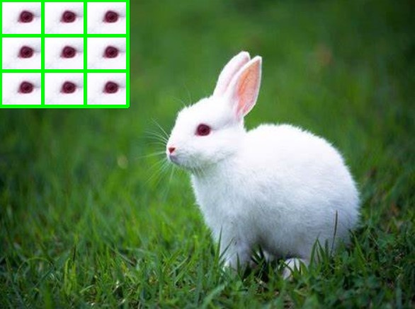

#开源硬件第一次作业

##第一题代码 图片

import numpy as np

import cv2

img = cv2.imread('rabbit.jpg')

for i in range(3):

    for j in range(3):
    
        img[i*50:i*50+50,j*60:j*60+60]=img[160:210,250:310]
        

cv2.imshow('image',img)

print(img.shape)

cv2.waitKey(10000)

cv2.destroyAllWindows()

##第二题代码 图片
import cv2

img = cv2.imread('homework1_1_img.jpg')

for x in range(3):

    for y in range(3):
    
        cv2.rectangle(img, (x*60, y*50), (x*60+60, y*50+50), (0, 255, 0), 3)
        
cv2.imshow('image',img)

print(img.shape)

cv2.waitKey(10000)

cv2.destroyAllWindows()

cv2.imwrite('homework1_2_img.jpg',img)

