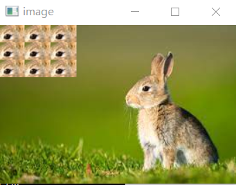

# 作业一
---
## 代码
```
{
import numpy as np
import cv2

img = cv2.imread('C:/Users/hp/Desktop/download.jpg')

for i in [1,2,3]:
    for j in [1,2,3]:
        img[20*j-20:20*j-,30*i-30:30*i]=img[60:80,160:190]
cv2.imshow('image',img)
cv2.waitKey(0)
cv2.destroyAllWindows()
print(img.shape)

}
```
---
## 图片

