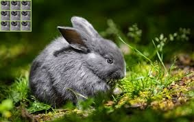

## 作业一_兔子

### 1.代码


```python
for i in range(3):
    for j in range(3):
        img[i*15:(i+1)*15,j*15:(j+1)*15]=img[85:100,155:170]
cv2.imshow('image',img)
cv2.waitKey(0)
cv2.destroyAllWindows()

cv2.imwrite('9eyes.jpg',img)
```

```python
for i in range(3):
    for j in range(3):
        cv2.rectangle(img,(i*15,j*15),((i+1)*15,(j+1)*15),(102,205,170),1) #左上角顶点,右下角顶点,颜色，线宽
cv2.imshow('image',img)
cv2.waitKey(0)
cv2.destroyAllWindows()

cv2.imwrite('9rectangles.jpg',img)
```

### 2.结果



